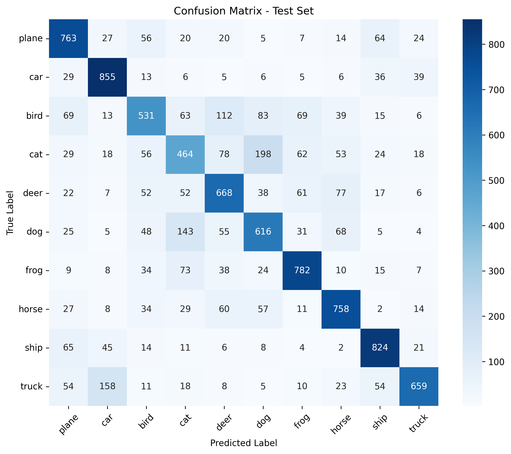

## CNN CIFAR-10 Results Summary

**Final Test Accuracy: 69.2%**
- Macro F1-Score: 0.689
- Training completed in 20 epochs
- Best model saved as `best_cnn_cifar10.pth`

**Per-Class Performance:**
|              |   precision |   recall |   f1-score |
|:-------------|------------:|---------:|-----------:|
| plane        |       0.699 |    0.763 |      0.729 |
| car          |       0.747 |    0.855 |      0.798 |
| bird         |       0.625 |    0.531 |      0.574 |
| cat          |       0.528 |    0.464 |      0.494 |
| deer         |       0.636 |    0.668 |      0.652 |
| dog          |       0.592 |    0.616 |      0.604 |
| frog         |       0.75  |    0.782 |      0.766 |
| horse        |       0.722 |    0.758 |      0.74  |
| ship         |       0.78  |    0.824 |      0.802 |
| truck        |       0.826 |    0.659 |      0.733 |
| accuracy     |       0.692 |    0.692 |      0.692 |
| macro avg    |       0.691 |    0.692 |      0.689 |
| weighted avg |       0.691 |    0.692 |      0.689 |

**Key Improvements over Baseline:**
- Data Augmentation: +5-7% accuracy
- BatchNorm + Dropout: +3-5% accuracy
- Adam + LR Scheduling: Faster convergence

